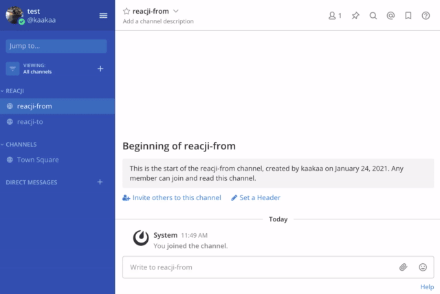

[](https://circleci.com/gh/kaakaa/mattermost-plugin-reacji)

# Mattermost Plugin Reacji

Mattermost Reacji plugin inspired by [Slack's Reacji Channeler](https://reacji-channeler.builtbyslack.com/)



## Install

Download plugin from [Releases](https://github.com/kaakaa/mattermost-plugin-reacji/releases/latest) and Install plugin in **System Console > Plugin > Plugin Management**  
[Plugins \(Beta\)](https://docs.mattermost.com/administration/plugins.html#set-up-guide)

## Usage

1. Add reacji to channels (e.g. execute `/reacji add :+1: ~off-topic` in `town-square`)
2. React to any posts in `town-square` with `:+1:`
3. Plugin will share the post attached `:+1:` to `~off-topic`

### Commands

```
/reacji add :EMOJI: ~CHANNEL: Register new reacji. If you attach EMOJI to the post, the post will share to CHANNEL.
/reacji list [--all]: List reacjis that is registered in channel. With --all list all registered reacjis in this server.
/reacji remove [Deletekey...]: Remove reacjis by DeleteKey (creator or system admin only)
/reacji remove-all: Remove all existing reacjis (system admin only)`
/reacji help: Show help
```

## Notes

-   Couldn't set private channel and DM/GM channel as `to` channel
