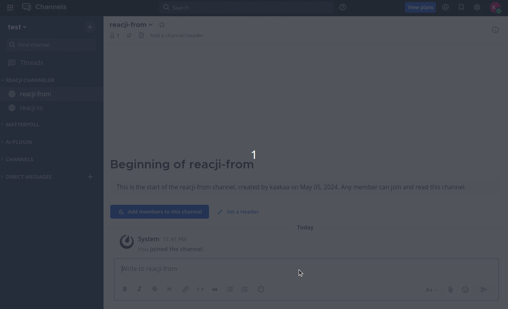

[](https://github.com/kaakaa/mattermost-plugin-reacji/actions/workflows/ci.yml)

# Mattermost Plugin Reacji

Mattermost Reacji plugin inspired by [Slack's Reacji Channeler](https://reacji-channeler.builtbyslack.com/)



## Install

Download Reacji plugin file from [Releases](https://github.com/kaakaa/mattermost-plugin-reacji/releases/latest) and Install plugin in **System Console > Plugin > Plugin Management**  

[Use and manage plugins](https://developers.mattermost.com/integrate/plugins/using-and-managing-plugins/#custom-plugins)

### Settings

Change settings for this plugin in **System Console > Plugins > Reacji Channeler**.

-   **Allow duplicate sharing**: Setting to determine if posts that have already been shared should be shared again each time a reaction is attached.
-   **Days to keep shared record**: After the number of days for this setting has passed, posts that have been shared once will be share again even if **Allow duplicate shareing** is `false`.
-   **Max Reacjis**: Maximum number of reacjis per Mattermost instance (not per team).

## Usage

### Add reacji

1. Add reacji to channels (e.g. execute `/reacji add :+1: ~off-topic`)
2. React to any posts in any public channels in the team with `:+1:`
3. Plugin will share the post attached `:+1:` to `~off-topic`

### Add reacji with channel restriction

1. Add reacji to channels (e.g. execute `/reacji add-from-here :+1: ~off-topic` in `town-square`)
    - Share only posts in the channel where `/reacji add-from-here` was executed
2. React to any posts in `town-square` with `:+1:`
3. Plugin will share the post attached `:+1:` to `~off-topic`
4. React to any posts in channels except for `town-square` never fire sharing

### Allow to share posts in private channel

1. Invite `Reacji Bot` to the team from **Main Menu > Invite People**
2. Invite `Reacji Bot` to the private channel where you want to share posts by reacji
3. Add reacji to channels (e.g. execute `/reacji add :+1: ~off-topic`)
4. React to any posts in the private channel where `Reacji Bot` is member

### Commands

```
/reacji add :EMOJI: ~CHANNEL: Register new reacji. If you attach EMOJI to the post in any channels except for DM/GM, the post will share to CHANNEL.
/reacji add-from-here :EMOJI: ~CHANNEL: Register new reacji. If you attach EMOJI to the post in the channel where this command is executed, the post will share to CHANNEL.
/reacji list [-all]: List reacjis that is registered in channel. With **--all** list all registered reacjis in this server.
/reacji remove [Deletekey...]: [CREATOR or SYSTEM_ADMIN only] Remove reacjis by DeleteKey.
/reacji remove-all: [SYSTEM_ADMIN onlye] Remove all existing reacjis.
/reacji refresh-caches: [SYSTEM_ADMIN only] Delete all caches.
/reacji help: Show help
```

## Notes

-   **Reacji with emoji alias will never be fired**. See [details](./notes-alias.md).
-   Couldn't set private channel and DM/GM channel as `to` channel
-   Never fire any reacjis for posts in DM/GM channel even if FromChannel is `[ALL-CHANNELS]`

## Licence

See [LICENSE](./LICENSE)
